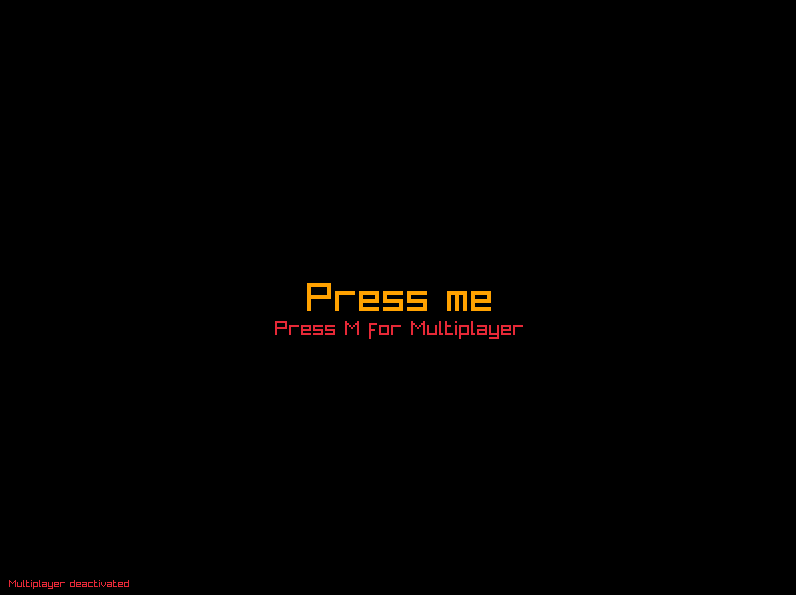
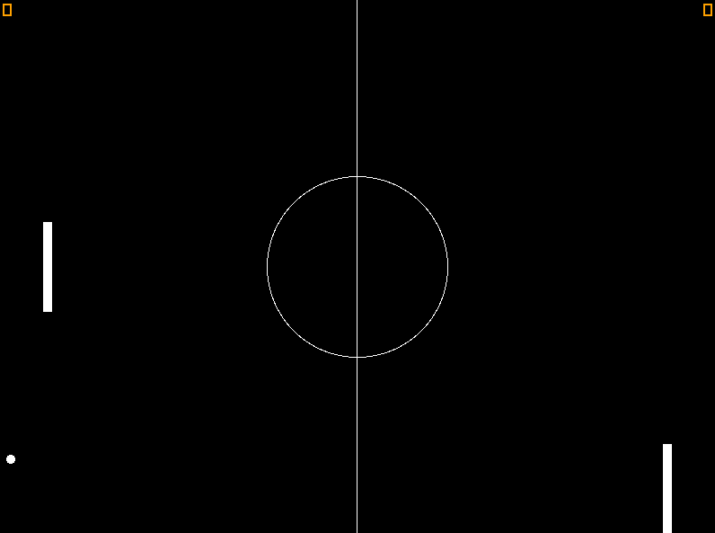

# Pong Game with Raylib - Multiplayer and Singleplayer

## Pong Game
- [Pictures](#pictures)
- [Description](#description)
- [Installation](#installation-for-visual-studio)
- [Controls](#controls)

Welcome to the Pong Game implemented in C++ using the [Raylib library](https://www.raylib.com). This classic game allows you to play either in multiplayer mode, competing against a friend, or in singleplayer mode, where you can challenge a bot. Get ready to relive the nostalgia of one of the earliest arcade games!

## Pictures

## Description
- This game is a simple implementation of the classic Pong game.
- The game has two modes: Multiplayer and Singleplayer.
- In multiplayer mode, two players can compete against each other.
- In singleplayer mode, you can challenge a bot.
- The game has a start screen where you can choose the game mode.
- The game has a score display for both players.

## Installation for Visual Studio
- In the project properties, set the following:
  - C/C++ > General > Additional Include Directories: `./libraries/raylib-4.5.0/include`
  - Linker > General > Additional Library Directories: `./libraries/raylib-4.5.0/lib`

## Controls
### Player 1 (Left Paddle) Multiplayer:
- Move Up: W
- Move Down: S

### Player 2 (Right Paddle) Multiplayer:
- Move Up: I
- Move Down: K

### Singleplayer (Against Bot):
- Move Up: W
- Move Down: S

## Game Modes
### Multiplayer Mode
In multiplayer mode, two players can compete against each other. Player 1 controls the left paddle with W and S keys, while Player 2 controls the right paddle with I and K keys.

### Singleplayer Mode
In singleplayer mode, you can challenge a bot. You control the left paddle using W and S keys. The bot controls the right paddle.
